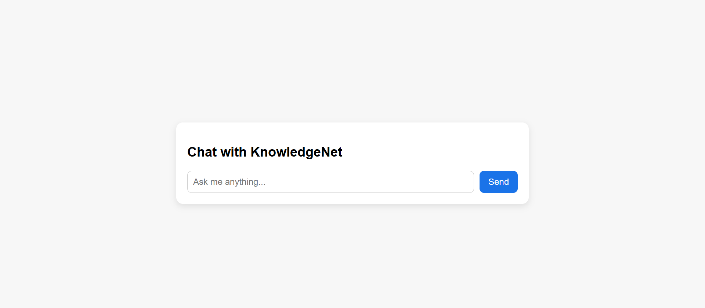

# 🧠 KnowledgeBot

**KnowledgeBot** is a inhouse knowledge web application that allows document upload and AI-powered chat through a Retrieval-Augmented Generation (RAG) pipeline, leveraging a vector store for context-aware responses.

---

## ✨ Features

| Feature             | Description                                                                                 |
|---------------------|---------------------------------------------------------------------------------------------|
| 📁 **Document Upload** | Admin page for uploading `.pdf` and `.csv` files, feeding a vector store for RAG processing |
| 💬 **Chatbox**      | User-friendly interface to interact with an AI that retrieves knowledge from uploaded docs |

---

## 🗂 Project Structure

```
n8n_chatAI/
├── app.py
├── templates/
│   ├── index.html
│   └── upload.html
├── n8n_workflow/
    ├── Knowledge_base_n8n_ollama.json
├── requirements.txt
└── README.md
```
---

## ⚙️ How to run the application

### 1. Install n8n:

```bash
npm install -g n8n
n8n start
#n8n run on local server on http://127.0.0.1:5678
```

### 2. Install qdrant on Window OS:

#### Step 1: Download Binary
- Visit the Qdrant GitHub Releases page.
- Download the latest qdrant-windows-x86_64.zip file (or similar).
- Extract it into a folder (C:\\qdrant).
- Run Qdrant .exe binary from the folder
```bash
qdrant.exe
#n8n run on local server on http://127.0.0.1:6333
```

### 3. Install ollama on Window OS:

#### Step 1: Download Ollama 
- Visit the here to download the ollama executable https://ollama.com/download
- Download the window os executable.
- Install the window executable using the window installer.
- After the installation ollama is running.
```bash
ollama pull llama3.2:latest
ollama pull nomic-embed-text:latest
#n8n run on local server on http://127.0.0.1:11434
```

### 4. Install dependencies:

```bash
pip install -r requirements.txt
```
---

## Start the flask app

```bash
python app.py
# Open your browser and visit
# http://127.0.0.1:5000/
```

## 🔧 Configuration

Their is already a `.env` file in the root directory:
just file the CHATWEBHOOK and UPLOADWEBHOOK

```env
N8N_CHAT_WEBHOOK=http://127.0.0.1:5678/webhook/chatwithai
N8N_UPLOAD_WEBHOOK=http://127.0.0.1:5678/webhook/uploadfile
```

### Import n8n Workflow
Visit http://127.0.0.1:5678 and sign up/log in.

- Click the workflow icon (as shown in the screenshot) 
- Click the three-dot menu 
- Click "Import from file" and select the Knowledge_base_n8n_ollama.json file from the n8n_workflow/ folder 
- You should see this 

---

## 🧠 How it Works

### Admin Upload


- Upload PDF or CSV files via the admin page
- Files are processed and stored in a vector store

### Chat Interface

- Users enter queries
- RAG model fetches relevant document chunks
- AI responds with context-based answers

## 📝 To Do / Ideas

- [x] Build file upload functionality
- [x] Implement basic chatbox UI
- [x] Integrate vector store (e.g., Qdrant, Pinecone)
- [x] Connect RAG pipeline to chat
- [ ] Add user authentication for admin page
- [ ] Dockerize the application
